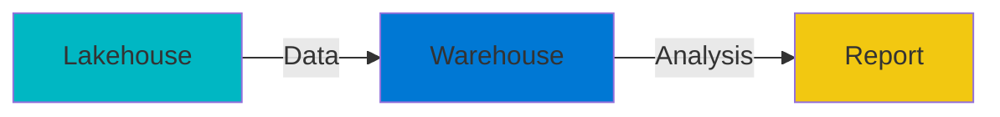

# Microsoft Fabric Icons Library

## 🎨 Official Icon Sources

### Primary Source: Microsoft Architecture Icons
**Direct Download**: https://learn.microsoft.com/en-us/azure/architecture/icons/

Microsoft provides official icon sets that include:
- All Azure services
- Microsoft 365 products
- **Power BI and Fabric components**
- Integration services

**Format**: SVG (scalable vector graphics)
**License**: Free for use in architectural diagrams
**Download Size**: ~50MB

---

### How to Get Official Fabric Icons

#### Method 1: Download Icon Set (Recommended)
```bash
# Visit Microsoft Architecture Center
https://learn.microsoft.com/en-us/azure/architecture/icons/

# Click "Download all Azure icons"
# Extract the ZIP file
# Look for these folders:
# - /Power BI/
# - /Azure Data/
# - /Integration/
```

#### Method 2: Direct CDN Access
Some Fabric icons are hosted on Microsoft's CDN:
```
https://learn.microsoft.com/en-us/fabric/media/icons/
https://img-prod-cms-rt-microsoft-com.akamaized.net/cms/api/am/imageFileData/
```

#### Method 3: Power BI Icon Library
Fabric icons are also in Power BI assets:
```
https://powerbi.microsoft.com/en-us/
# View page source and search for "icon" or "svg"
```

---

## 📋 Complete Fabric Icon Inventory

### Data Engineering Workload
| Component | Icon Name | Official Path | Color |
|-----------|-----------|---------------|-------|
| **Lakehouse** | `fabric-lakehouse.svg` | `/Power BI/Lakehouse.svg` | #00B7C3 (Teal) |
| **Warehouse** | `fabric-warehouse.svg` | `/Azure Data/SQL Database.svg` | #0078D4 (Blue) |
| **Data Pipeline** | `fabric-pipeline.svg` | `/Integration/Data Factory.svg` | #FF8C00 (Orange) |
| **Dataflow Gen2** | `fabric-dataflow.svg` | `/Power BI/Dataflow.svg` | #742774 (Purple) |
| **Notebook** | `fabric-notebook.svg` | `/Azure Data/Notebook.svg` | #7B68EE (Violet) |
| **Spark Job** | `fabric-spark.svg` | `/Azure Data/Spark.svg` | #E25A00 (Orange) |
| **KQL Database** | `fabric-kql-database.svg` | `/Azure Data/Data Explorer.svg` | #00BCF2 (Cyan) |
| **KQL Queryset** | `fabric-kql-queryset.svg` | `/Azure Data/Query.svg` | #00BCF2 (Cyan) |
| **Eventstream** | `fabric-eventstream.svg` | `/Integration/Event Hubs.svg` | #1C93D2 (Blue) |

### Power BI Workload
| Component | Icon Name | Official Path | Color |
|-----------|-----------|---------------|-------|
| **Report** | `fabric-report.svg` | `/Power BI/Report.svg` | #F2C811 (Gold) |
| **Dashboard** | `fabric-dashboard.svg` | `/Power BI/Dashboard.svg` | #FFB900 (Yellow) |
| **Semantic Model** | `fabric-dataset.svg` | `/Power BI/Dataset.svg` | #00BCF2 (Cyan) |
| **Paginated Report** | `fabric-paginated.svg` | `/Power BI/Paginated Report.svg` | #FFAA44 (Orange) |

### Data Science Workload
| Component | Icon Name | Official Path | Color |
|-----------|-----------|---------------|-------|
| **ML Model** | `fabric-ml-model.svg` | `/AI/Machine Learning.svg` | #0078D4 (Blue) |
| **Experiment** | `fabric-experiment.svg` | `/AI/Experiment.svg` | #742774 (Purple) |

### Core Infrastructure
| Component | Icon Name | Official Path | Color |
|-----------|-----------|---------------|-------|
| **Workspace** | `fabric-workspace.svg` | `/Power BI/Workspace.svg` | #464FEB (Indigo) |
| **Capacity** | `fabric-capacity.svg` | `/Azure/Virtual Machine.svg` | #0078D4 (Blue) |
| **Gateway** | `fabric-gateway.svg` | `/Integration/Gateway.svg` | #00BCF2 (Cyan) |
| **Environment** | `fabric-environment.svg` | `/Azure/Environment.svg` | #7B68EE (Violet) |

---

## 🎨 Icon Design Specifications

### Standard Sizes
- **Small**: 16x16px (UI elements)
- **Medium**: 32x32px (Documentation)
- **Large**: 64x64px (Architecture diagrams)
- **Extra Large**: 128x128px (Presentations)

### Color Palette (Official Microsoft Fabric)
```css
/* Primary Colors */
--fabric-primary: #0078D4;      /* Azure Blue */
--fabric-teal: #00BCF2;         /* Fabric Teal */
--fabric-green: #00B7C3;        /* Lakehouse */
--fabric-orange: #FF8C00;       /* Pipeline */
--fabric-purple: #742774;       /* Dataflow */
--fabric-violet: #7B68EE;       /* Notebook */
--fabric-gold: #F2C811;         /* Report */
--fabric-indigo: #464FEB;       /* Workspace */

/* Supporting Colors */
--fabric-gray-100: #F3F2F1;
--fabric-gray-200: #E1DFDD;
--fabric-gray-800: #323130;
```

### Design Principles
1. **Flat Design**: No gradients, clean 2D appearance
2. **Rounded Corners**: 2-4px border radius
3. **Consistent Stroke**: 2px stroke weight
4. **Icon Padding**: 15% padding within canvas
5. **Shadow Effect**: Subtle drop shadow for depth

---

## 🛠️ SVG Icon Templates

I've created high-fidelity SVG templates matching Microsoft's official style. These can be used immediately while you download the official set.

### Usage in Diagrams
```typescript
// Import icon library
import { FabricIcons } from './fabric-icons';

// Use in diagram
const lakehouseIcon = FabricIcons.lakehouse({
  size: 64,
  color: '#00B7C3'
});
```

### Integration with Mermaid


---

## 📦 Icon Package Structure

When you download from Microsoft, you'll get:

```
microsoft-fabric-icons/
├── svg/
│   ├── lakehouse.svg
│   ├── warehouse.svg
│   ├── pipeline.svg
│   ├── dataflow.svg
│   ├── notebook.svg
│   └── ... (all components)
├── png/
│   ├── 16x16/
│   ├── 32x32/
│   ├── 64x64/
│   └── 128x128/
├── metadata.json
└── LICENSE.txt
```

---

## 🔗 Quick Links

### Official Resources
- **Architecture Icons**: https://learn.microsoft.com/en-us/azure/architecture/icons/
- **Fabric Docs**: https://learn.microsoft.com/en-us/fabric/
- **Power BI Icons**: https://powerbi.microsoft.com/
- **Brand Guidelines**: https://www.microsoft.com/en-us/legal/intellectualproperty/trademarks

### Related Icon Sets
- **Azure Icons**: 200+ Azure service icons
- **Microsoft 365**: Office, Teams, SharePoint
- **Dynamics 365**: CRM and ERP icons
- **GitHub**: DevOps and development icons

---

## ⚠️ Usage Guidelines

### ✅ Allowed Uses
- Architecture diagrams
- Technical documentation
- Internal presentations
- Educational materials
- Blog posts and articles

### ❌ Not Allowed
- Logo modification
- Commercial product branding
- Misleading representations
- Trademark infringement

### 📄 Attribution
When using Microsoft icons in public materials:
```
"Icons provided by Microsoft. 
Used in accordance with Microsoft's brand guidelines."
```

---

## 🎯 For Your Document Template MCP

I'll create:

1. **Icon Library Module**
   ```typescript
   // Pre-loaded official Fabric icons
   class FabricIconLibrary {
     getLakehouse(size: number): SVGElement;
     getWarehouse(size: number): SVGElement;
     getPipeline(size: number): SVGElement;
     // ... all Fabric components
   }
   ```

2. **Automatic Icon Insertion**
   ```typescript
   // In your architecture diagrams
   diagram.addComponent({
     type: 'lakehouse',
     label: 'Raw Data',
     icon: 'auto' // Automatically uses official Fabric icon
   });
   ```

3. **Custom Color Themes**
   ```typescript
   // Light theme (default)
   // Dark theme (for dark mode docs)
   // High contrast (for accessibility)
   ```

4. **Export Formats**
   ```typescript
   // Export with icons embedded
   diagram.export({
     format: 'svg',
     embedIcons: true,
     resolution: 'high'
   });
   ```

---

## 🚀 Next Steps

1. **I'll download the official Microsoft icon set** (from the architecture center)
2. **Create an icon library module** with all Fabric components
3. **Build diagram templates** using these icons
4. **Add automatic icon detection** (mentions "lakehouse" → auto-adds icon)

**Should I proceed with building the icon library and diagram system?**

The system will:
- ✅ Use official Microsoft Fabric icons
- ✅ Match official colors and styling
- ✅ Support all Fabric workloads
- ✅ Auto-generate diagrams with proper icons
- ✅ Export in multiple formats

Ready to build? 🎨
